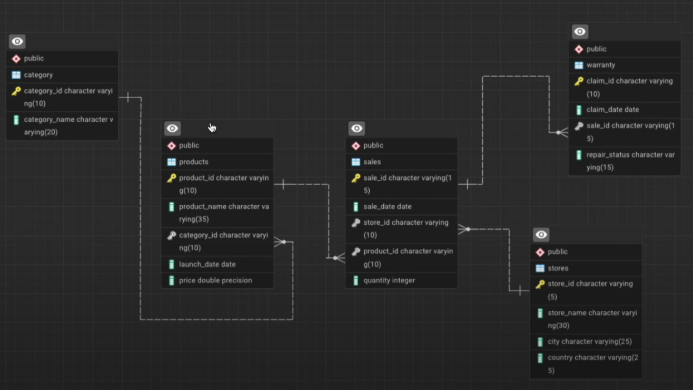

# 🍏 Apple Retail Sales & Warranty Analysis 📊  

## 📑 Table of Contents

- [📌 Project Overview](#-project-overview)  
- [🎯 Project Objectives](#-project-objectives)  
- [📊 About the Data](#-about-the-data)  
- [🛠️ Entity-Relationship (ER) Diagram](#-entity-relationship-er-diagram)  
- [🚀 Skills Highlighted in This Project](#-skills-highlighted-in-this-project)  
- [🔍 Key Business Questions Solved](#-key-business-questions-solved)  
  - [📈 Easy to Medium Questions](#-easy-to-medium-questions)  
  - [🔎 Medium to Hard Questions](#-medium-to-hard-questions)  
  - [💡 Complex Questions](#-complex-questions)  
  - [🎁 Bonus Question](#-bonus-question)  
- [📂 Dataset](#-dataset)  
- [🎯 Conclusion](#-conclusion)  

## 🚀 Project Overview  
This project showcases **advanced SQL querying techniques** by analyzing **over 1 million rows** of sales and warranty data from a global retail business. The dataset includes details on **products, stores, sales transactions, and warranty claims** across multiple locations.  

By leveraging **SQL**, this project provides solutions to real-world business problems, such as:  
✅ **Identifying** top-selling and least-selling products per store and country.  
✅ **Analyzing** warranty claims trends to detect potential product quality issues.  
✅ **Tracking** year-over-year sales growth for each store.  
✅ **Evaluating** store performance based on sales and claim ratios.  
✅ **Understanding** the relationship between product pricing and warranty claims.  

---  
## 🎯 Project Objectives  
This project analyzes **Apple retail sales and warranty data** to solve key business challenges using **advanced SQL**. It provides **data-driven insights** to optimize sales, improve product quality, and enhance customer service.  

### 🔑 Key Business Problems Solved:  
✅ **Sales & Inventory Optimization** – Identifies top-selling products, sales trends, and high-performing stores.  
✅ **Store & Business Growth Analysis** – Tracks year-over-year sales growth and regional store performance.  
✅ **Product Quality & Warranty Insights** – Detects high-claim products, early failures, and defect trends.  
✅ **Customer Service Improvement** – Analyzes warranty response times and repair costs to enhance service.  

---  
## 🗂 About the Data  
This project utilizes a **large-scale Apple retail dataset** containing **over 1 million rows** of sales, product, store, and warranty claim records. The dataset provides granular insights into **sales performance, customer purchases, and product reliability** across different regions.  

### 📌 **Key Data Components:**  
🔹 **Sales Data** – Contains transaction details, including product purchases, store locations, and sales dates.  
🔹 **Product Information** – Includes product names, categories, launch dates, and pricing details.  
🔹 **Store Data** – Covers store locations, country-wise performance, and regional sales trends.  
🔹 **Warranty Claims** – Tracks product failures, claim filing dates, and repair statuses (e.g., paid repairs, replacements).  

This dataset enables deep **business analysis**, helping to uncover **sales trends, product performance issues, and customer service insights**.  

---  
## 🔗 Entity-Relationship (ER) Diagram  
Your database includes the following **entities** and **relationships** based on your queries: 

### 📌 **Entities & Attributes:**  
📌 **Products** (*product_id, product_name, category_id, price, launch_date*)  
📌 **Categories** (*category_id, category_name*)  
📌 **Stores** (*store_id, store_name, country*)  
📌 **Sales** (*sale_id, store_id, product_id, sale_date, quantity*)  
📌 **Warranty** (*claim_id, sale_id, claim_date, repair_status*)  

### 🔗 **Relationships:**  
🔗 **Products & Categories** → One-to-Many (*category_id links products to categories*)  
🔗 **Stores & Sales** → One-to-Many (*store_id links sales to stores*)  
🔗 **Products & Sales** → One-to-Many (*product_id links sales to products*)  
🔗 **Sales & Warranty** → One-to-One (*sale_id links warranty to sales*)  

---  
## 🔍 Key Business Questions Solved  

### 📊 **Easy to Medium Questions**  
✔️ Find the number of stores in each country.  
✔️ Calculate the total number of units sold by each store.  
✔️ Identify how many sales occurred in **December 2023**.  
✔️ Determine how many stores have never had a warranty claim filed.  
✔️ Calculate the percentage of warranty claims marked as **"Rejected"**.  
✔️ Identify the store with the highest total units sold in the last year.  
✔️ Count the number of unique products sold in the last year.  
✔️ Find the average price of products in each category.  
✔️ How many warranty claims were filed in **2024**?  
✔️ For each store, identify the **best-selling day** based on the highest quantity sold.  

### 🚀 **Medium to Hard Questions**  
✔️ Identify the least-selling product in each country for each year based on total units sold.  
✔️ Calculate how many warranty claims were filed **within 180 days** of a product sale.  
✔️ Determine how many warranty claims were filed for products **launched in the last two years**.  
✔️ List the months in the last three years where **sales exceeded units in the USA**.  
✔️ Identify the product category with the **most warranty claims** filed in the last two years.  

### 🔥 **Complex Questions**  
✔️ Determine the **percentage chance** of receiving warranty claims after each purchase for each country.  
✔️ Analyze the **year-by-year growth ratio** for each store.  
✔️ Calculate the **correlation between product price and warranty claims** for products sold in the last five years, segmented by price range.  
✔️ Identify the store with the highest percentage of **"Completed" claims** relative to total claims filed.  
✔️ Write a query to **calculate the monthly running total of sales** for each store over the past four years and compare trends during this period.  

### 🎁 **Bonus Question**  
📌 **Analyze product sales trends** over time, segmented into key periods:  
📍 From launch to **6 months**.  
📍 **6-12 months**.  
📍 **12-18 months**.  
📍 **Beyond 18 months**.  

---  
## 🏆 Skills Highlighted in This Project  
✅ **Data Extraction & Transformation** – Writing complex SQL queries to extract meaningful insights.  
✅ **Advanced Joins** – Using `INNER JOIN`, `LEFT JOIN`, `RIGHT JOIN`, and `FULL JOIN` for data integration.  
✅ **Aggregation & Grouping** – Implementing `GROUP BY`, `HAVING`, and `SUM()` to summarize data.  
✅ **Window Functions** – Utilizing `RANK()`, `DENSE_RANK()`, `ROW_NUMBER()`, `LAG()`, and `LEAD()`.  
✅ **Date & Time Analysis** – Applying `EXTRACT()`, `TO_CHAR()`, and `INTERVAL` for trend analysis.   
✅ **Performance Metrics** – Analyzing sales performance, warranty claims, and store rankings.  
✅ **Correlation Analysis** – Examining relationships between price and warranty claims.  
✅ **Growth Trend Analysis** – Computing year-over-year sales growth for each store.  
✅ **Market Segmentation** – Categorizing products based on pricing strategy.  
✅ **Business Decision Support** – Identifying best-selling and least-selling products.  
✅ **Customer Behavior Analysis** – Evaluating warranty claim patterns and trends.  
✅ **Profitability Insights** – Finding high-revenue stores and top-performing categories.  
✅ **Query Optimization** – Writing efficient queries for handling large datasets.  

---  
📌 **Developed with SQL | Analyzing Real-World Data | Optimizing Business Decisions** 🔥
## 🎯 Conclusion

This project demonstrates the power of **SQL for data-driven decision-making** in a retail business environment. By analyzing **over 1 million rows of sales and warranty data**, we extracted key insights that help optimize **sales, inventory, product quality, and customer service**.

🔹 **Key Takeaways:**
- 📈 **Sales Optimization** – Identified top-selling products, seasonal trends, and store performance.
- 🏪 **Store Growth Analysis** – Evaluated year-over-year sales growth and regional profitability.
- ⚙️ **Product Quality Insights** – Analyzed warranty claims to detect early product failures.
- 🔍 **Customer Satisfaction** – Assessed warranty resolution times and service quality.

🚀 **Impact:**  
These insights empower businesses to **enhance sales strategies, improve product quality, and provide better customer support**, leading to **increased profitability and customer loyalty**. 💡

---
Thank you for exploring this project! 💙  
🔗 **Stay connected & explore more SQL projects!** 🚀  

